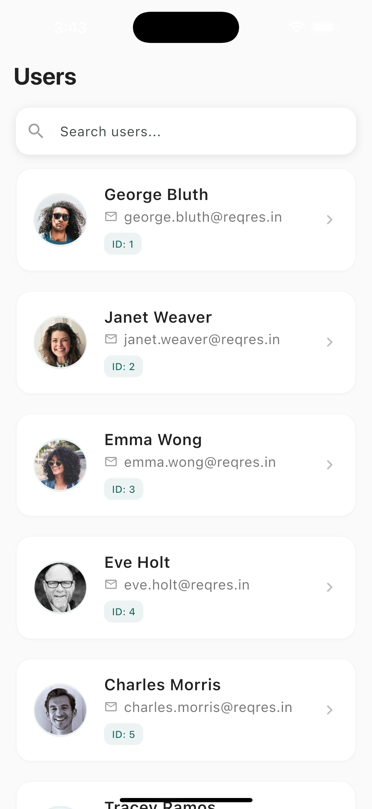
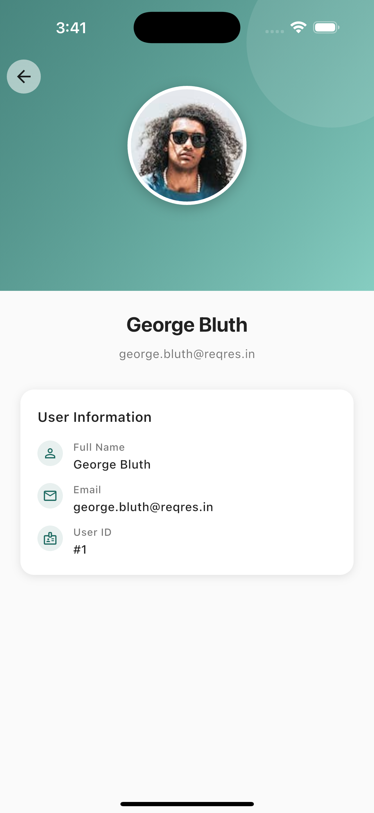

# 🧑‍💼 Sokrio User List

A Flutter application developed as part of the **Sokrio Technologies Ltd.** Flutter Developer assignment.

This app demonstrates **Clean Architecture**, **state management (Bloc)**, **API integration**, **pagination**, and **offline-safe search filtering** — all using data from the [ReqRes API](https://reqres.in/api/users).

---

## 📱 App Overview

The **Sokrio User List** app allows users to:
- View a paginated list of users with their profile pictures.
- Tap on a user to see detailed information (name, email, phone, avatar).
- Search for users locally (even when offline).
- Gracefully handle API errors, no internet, and empty responses.

---

## 🧠 Key Features

| Feature | Description |
|----------|-------------|
| 🧾 **User List Screen** | Displays a paginated list of users with profile pictures and names. |
| 👤 **User Detail Screen** | Shows detailed information for the selected user. |
| 🔍 **Search** | Filters users locally (works offline). |
| 🔄 **Pagination** | Infinite scrolling with smooth loading indicators. |
| 🚫 **Error Handling** | Handles no internet, empty data, and slow responses with retry options. |
| 🧩 **Clean Architecture** | Data → Domain → Presentation separation for scalability. |
| ⚙️ **State Management** | Implemented using **Bloc** and **flutter_bloc**. |
| 💾 **(Bonus)** Optional caching with Hive or SharedPreferences. |

---

## 🏗️ Project Structure

```
lib/
├── core/                          # Shared utilities, widgets, and networking
│   ├── constants/
│   ├── network/
│   └── widgets/
│
├── feature/
│   └── user/
│       ├── data/
│       │   ├── datasources/
│       │   ├── models/
│       │   └── repositories/
│       │
│       ├── domain/
│       │   ├── entities/
│       │   ├── repositories/
│       │   └── usecases/
│       │
│       ├── presentation/
│       │   ├── bloc/
│       │   ├── pages/
│       │   ├── widgets/
│       │   └── utils/
│       │
│       └── user_injection.dart
│
├── injection_container.dart
└── main.dart
```

---

## 🧩 Tech Stack

| Layer | Technology |
|--------|-------------|
| **State Management** | [Flutter Bloc](https://pub.dev/packages/flutter_bloc) |
| **HTTP Client** | [Http](https://pub.dev/packages/http) |
| **Architecture** | Clean Architecture (Data → Domain → Presentation) |
| **Dependency Injection** | get_it (optional) |
| **Offline Caching** | SharedPreferences |
| **UI Framework** | Flutter + Material 3 |

---

## 🚀 Getting Started

### 1️⃣ Clone the Repository
```bash
git clone git@github.com:mowlashuvo/sokrio_user_list.git
cd sokrio_user_list
```

### 2️⃣ Install Dependencies
```bash
flutter pub get
```

### 3️⃣ Run the App
```bash
flutter run
```

---

## 🌐 API Reference

This project uses the [ReqRes API](https://reqres.in) for demo data.

Example Endpoint:
```
GET https://reqres.in/api/users?per_page=10&page=1
```

---

## 🧱 Architecture Overview

```
┌────────────────────┐
│   Presentation     │  → Flutter UI, Bloc
└────────┬───────────┘
         │
┌────────▼───────────┐
│     Domain Layer    │  → Use cases, Entities, Repository interfaces
└────────┬───────────┘
         │
┌────────▼───────────┐
│      Data Layer     │  → API, Models, Repository implementations
└────────────────────┘
```

This separation makes the app:
- Easy to maintain and scale.
- Testable.
- Modular and reusable.

---

## ⚠️ Error & Edge Case Handling

| Scenario | Behavior |
|-----------|-----------|
| ⏳ **Slow API** | Shows a loading indicator with timeout fallback. |
| 📶 **No Internet** | Displays error message and retry button. |
| 🈳 **Empty Response** | Shows a friendly “No users found” message. |
| 🧩 **Search Edge Cases** | Handles special characters and spaces gracefully. |
| 🔙 **Navigation Safety** | Back navigation handled properly to avoid leaks. |
| 📱 **Responsive UI** | Works smoothly across all screen sizes. |

---

## 🧪 Bonus Features (Optional)

- ✅ Pull to refresh
- ✅ Offline caching
- ✅ Dependency Injection with `get_it`
- ✅ Unit & widget test cases

---

## 📸 Screenshots (To Add Later)

<table> <tr> <th>User List</th> <th>User Details</th> </tr> <tr> <td></td> <td></td> </tr> </table>

---

## 🧑‍💻 Author

**Arfatul Mowla Shuvo**  
Flutter Developer @ Hi-Tech Bangla
📍 Bangladesh  
🔗 [GitHub](https://github.com/mowlashuvo)
